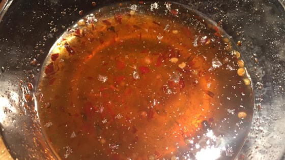

# Healthies

It seems that the progress of society has lead people to forming unhealthy habits. The velocity at which we run our lives makes it difficult to focus on so many aspects that contribute to our overall well-being, one of which being food. We live fast and we eat fast, and it is concerning that majority of popular recipes found on internet is in most cases classified as unhealthy. The goal of our project is to tackle this problem and allow people to make better decisions when forming their menus, by taking into account the healthiness of recipes and ingredients.

## Dataset

The data used for this project comes from one of the biggest recipe websites, [AllRecipes.com](http://allrecipes.com/). It includes information about recipes including descriptions, ingredients, nutritional facts and preparation steps and users with their reviews and interactions (made-it) with recipes. For the goal of analyzing the healthiness of recipes and ingredients, we focused mainly on the data on recipes, working with **40K** recipes with **6K** unique ingredients.

## Data Processing and Analysis

Each recipe comes in form of a dictionary with ingredients. Each ingredient has its unique identifier (id) and a label. The label contains information about the quantity of an ingredient in that specific recipe, but these quantities vary in terms of measurement types such as cups, grams, tablespoons... In order to analyze in what manner a certain ingredient influences a health score of a recipe, we had to preprocess these values and standardize them using a common measure like grams. This procedure can be found in [Quantity map]. 

## Regression on nutrient values

Having extracted quantities of ingredients in a recipe, we could use this as a recipe vector to run a linear regression and estimate which ingredient has an important influence on crucial recipe nutrients such as fats, sugars, cholesterol, fiber...

We can observe some of the results in the table:

| Sugars            | Fats          | Vitamin A |
| :-------------:    |:-------------:|:---------:|
|Highest scores
| packed brown sugar| heavy whipping cream | shredded carrots|
| white sugar       |  whole chicken, cut into pieces     | fresh spinach, stems removed |
|honey              |   pork spareribs, cut into serving size pieces         | large sweet potatoes, peeled and quartered|
| sweetened condensed milk | mayonnaise      |    chopped kale |
|container frozen whipped topping|Korean-style short ribs (beef chuck flanken)         | chicken broth  |
|Lowest scores
|Parmesan cheese|ice cubes|all-purpose flour
|salt and pepper to taste|vanilla-flavored vodka|white sugar
|shredded Cheddar cheese|whole wheat flour|confectioners' sugar
|mayonnaise|bread flour|ice cubes
|olive oil|lemon-lime flavored soda|mayonnaise

Overall score of an ingredient can be then calculated using the coefficients from linear regressor and taking into account both the negative nutrients (fats, sugars...) and positive ones like fibers, vitamins...

Overall healthiness:

|Healthiest ingredients| Least healthy ingredients
|:-------:|:-------:|
| brown lentils|heavy whipping cream
| Mexican-seasoned black beans| frozen whipped topping, thawed     
|kidney beans            |coconut milk
|garbanzo beans, drained|white sugar
| whole wheat flour |butter or margarine, melted

This kind of information gives us significant insights in overall structure of recipes in terms of healthiness, so we could use the extracted knowledge in eventual modification of recipes in order to achieve a more healthy result.

## Quasi redundancies 

The easiest approach would be just to exclude the unhealthy ingredient from a recipe. However, that in reality isn't a very good option, since it would lead to a situation in which the recipe looses its structure and practically becomes impossible to make. It is therefore important to analyze the structure of a recipe in order to conclude which ingredient could be modified. In order to do so, we first obtained a list of different recipe pairs according to their structure. By using jaccard metric to calculate distance between different recipes, we ended up with **20K** recipe pairs with a following structure: both recipes share "base" ingredients; one of the recipes from a pair has some "extra" ingredients. This allows us to conclude that the specific "extra" ingredients are not highly relevant to a recipe, and that even without them we would still end up with a doable recipe. Moreover, we could take into account the differences in quantities of ingredients in these specific pairs, to observe the way in which we can tune the quantities of ingredients in a recipe, in order to potentially reduce the portion of unhealthy ingredients in a recipe. This part is displayed in [Quasi redundancies]

|Variable ingredients| 
|:-------:|
| all-purpose flour
| white sugar    
|water
|milk
| butter or margarine, melted
|confectioners' sugar
|packed brown sugar
|potatoes, chopped
|bread flour
|semisweet chocolate chips

## Food2Vec

Another possible modification of a recipe could be in form of substituting one ingredient for another, more healthier version of it. However, in that case we come accross a question of a suitable method for discovering similar ingredients. For this, we could make use of the word2vec approach to recipes, by observing a specific recipe as a document or sentence, with ingredients building the corpus of the model. Ingredients are bounded by the recipe in which they occur, so we can use a cbow ('continuous-bag-of-words') model with recipe context to represent ingredient vectors in latent space. The procedure and results are displayed in [Embeddings.ipynb] 

If we combine this with the previously obtained knowledge, we could show health scores of ingredients in latent space. In the case of proteins, we clearly observe separation of vectors to meat with ususally high amounts of proteins and fruits with low.

## Wasserstein distances

Now, this leads us to an even more interesting approach to recipes. We could interpret recipe as a histogram of ingredient quentites. Indeed, when we normalize recipe vector by the sum of its ingredients' quantites we define a quantity distribution. Each of the ingredients is a vector in latent space, so transforming one recipe to another can be implemented by solving an optimal transport problem, in which our goal is to transport ingredients and their quantities from one recipe to another, while achieving an optimal cost. The distances between two ingredients is in this sense Euclidian distance between the ingredient vectors. In optimal case, we could arrive to a healthier recipe, while preserving its structure, which we can see in the example bellow. 

|Sweet and Spicy Dipping Sauce| Hot and Sweet Dipping Sauce
|:-------:|:-------:|
| 1/2 cup rice wine vinegar|1/2 cup rice vinegar
| 1/2 cup white sugar| 1/2 cup white sugar   
| 1 tablespoon chili garlic sauce (such as Lee Kum Kee®)        |1 1/2 teaspoons dried red pepper flakes
|2 teaspoons salt|1/4 teaspoon salt
|  |1 clove garlic, minced
|Health score: 5| Health score: 4

 

