# Foodies

The aim of this project is to gather, process and analyze a recipes social networks data and interactions in order to produce relevant insight about users behaviour and produce meaningful personalized recommendation for recipes.

## Dataset

The data used for this project is from [AllRecipes.com](http://allrecipes.com/), which is considered the biggest recipes social network in the world.

AllRecipes being very protective of their data, no dataset is provided, hence all data required for the project has been scraped automatically from the website, using python scripts. The whole scraping process can be found in this [Scraper Notebook](python/Scraper.ipynb). The scraping is done in three steps: 

* First by emulating a user browsing the website page by page (20 recipes by pages), until the end, keeping tracks of the recipes links.
* Each recipes link is then explored and all relevant informations about them is stored (Description, ingredients, cooking steps, popularity, etc..). Plus, for each recipes the entire set of reviews with user, rating and comment is downloaded.
* Once all recipes and reviews are downloaded, we create a list of all users that have made at least one comment and we explore all users profiles and download for each of them the list of recipes they have made ("made-it" mention).

The data gathered is then composed of around:

* **60k** Recipes, with their descriptions, ingredients, nutritional facts, preparation steps.
* **3M** Recipe reviews by users, with ratings and text.
* **1M** Users
* **5M** User-Recipes interactions (made-it).

## Data Processing and Analysis

The data analysis aims at providing insight about users behaviour in the social network and recipes popularity trends. The analysis focuses on the implicit interactions of the users with the recipes (The 5M "made-it").

### Users interactions distribution

Figure 1 shows the distribution of interactions amongst users. As expected the distribution follows a power-law. 

    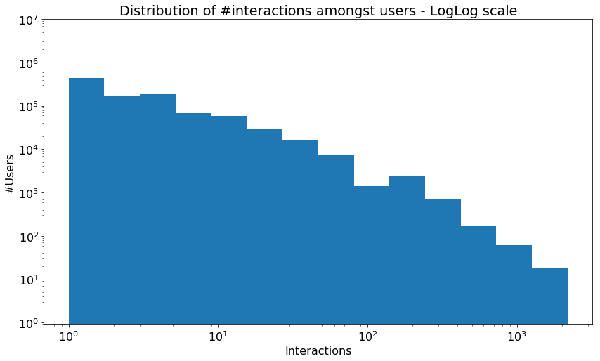
    
Figure 1: Users interactions distribution

It is also interesting to note that 78% of the users have less than 5 interactions.

### Recipes interactions distribution

Figure 2 shows the distribution of interactions amongst recipes. 

We observe that the distribution follows a power-law for the recipes with more than 10 interactions, but is cut for the unpopular recipes. It is highly likely an indicator that AllRecipes deletes unpopular recipes after a certain time.

This intuition is confirmed by the fact that more 30k recipes are present in the users "made-it" but are yet unavailable on the website.

    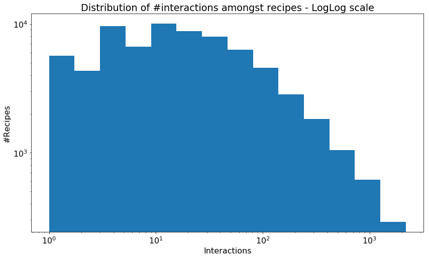
    
Figure 2: Recipe interactions distribution

### Cleaned datasets

After analyizing the dataset and clean the recipes without interactions, it remains in our interacitons dataset around:

* **1M** Users
* **38k** Recipes
* **4.5M** Made-it interactions

## Investigating Recipes Healthiness

As showns by this [study](http://www.christophtrattner.info/pubs/WWW2017.pdf), only a few percentage of the recipes found on AllRecipes are considered healthy according to the World Health Organization.

### Overall Recipes Healthiness

Given all the data obtained from the recipes, it is possible to process them in order to have an idea of how healthy they are according to health standards. The metric used is based on the [Traffic light rating system](https://en.wikipedia.org/wiki/Traffic_light_rating_system) used in some European countries for food labelling. It focuses on 4 main nutritional facts: Fat, Saturated Fat, Sugars and Salt. *cf: Figure 3* 

    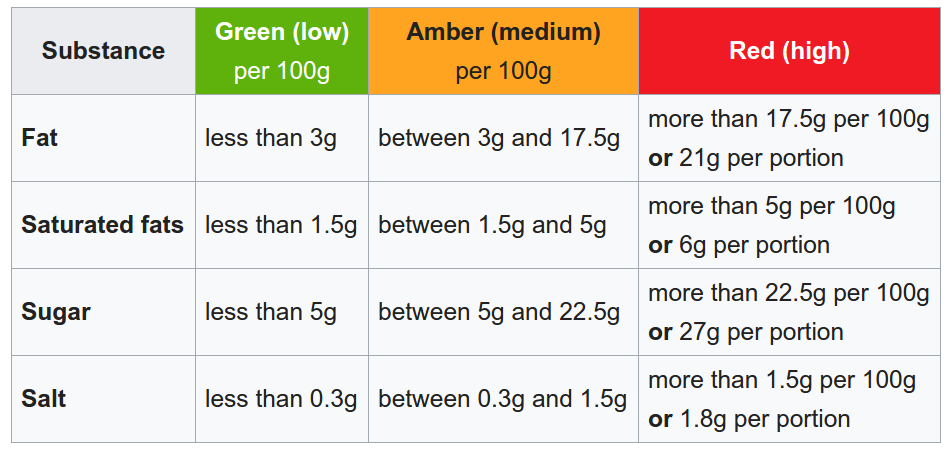
    
Figure 3: Traffic light rating system for food

It provides a score between 1 (healthy) and 3 (unhealthy) for each 4 facts. The scores of a recipe are additioned in order to produce a unique score between 4 and 12 representing the health score of the recipe. Figure 4 shows the distribution of all recipes of AllRecipes according to their computed health score.

    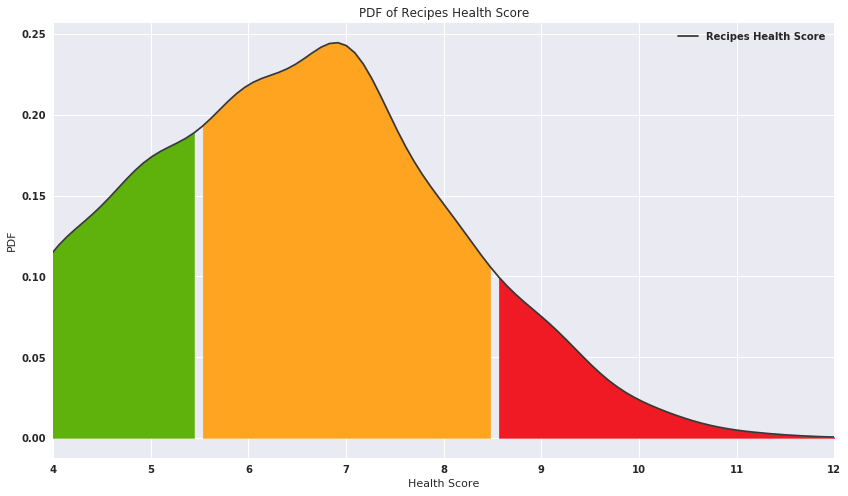
    
Figure 4: Distribution of recipes health scores

As expected from the previous study on the AllRecipes health score, relatively few recipes are considered healthy according to the standards.

### Healthiness by popularity

Figure 5 highlights the health score distribution difference between popular recipes (> 1000 users made it, in transparent blue) and unpopular recipes (< 100 users made it, in traffic light colors).

    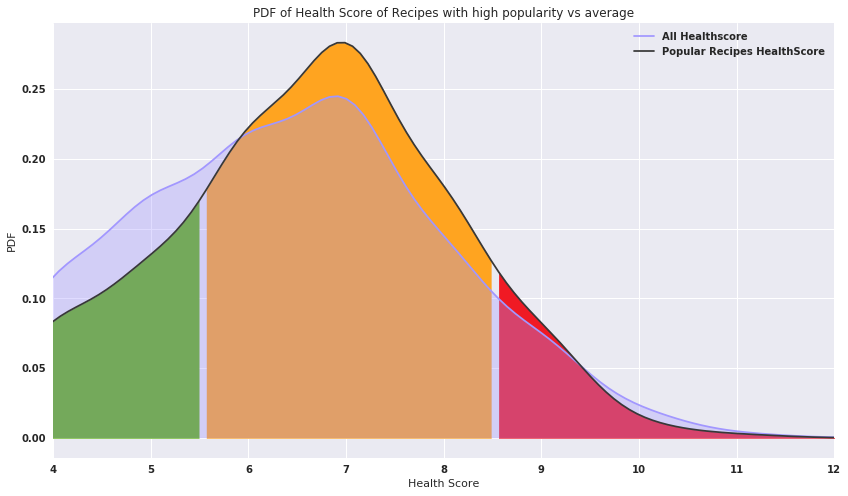
    
Figure 5: Distribution of recipes health scores comparison for high popularity

This shows, as stated by previous studies about AllRecipes, that **popular recipes tends to be less healthy**. 

## Recommender System

*The recommender system models developement is done in this [Model Notebook](./python/Model.ipynb)*

In order to build a recipe recommender system for the users based on their implicit feedback ("made-it"), a [Bayesian Personalized Ranking](https://arxiv.org/abs/1205.2618) (BPR) model is used.

BPR is the optimal model to use for user-personalized items ranking based on implicit feedback, which is exactly what we want to achive in our case.

BPR proceeds by successively selecting positive interactions between a user and a recipe (the user made the recipe) and negative interactions (user didn't make the recipe), and learns with SGD according to wheter or not it ranks the positive and negative interaction properly. The performance of the model is then assessed by computing the AUC score over a test set of the interactions, which represents the expectation that a random positive interaction is ranked before a random negative interaction.

*Note:* The data used to build the recommender models takes only into account users and recipes with more than 10 interactions. It also discards outliers users with more than 200 interactions. This represents around:

* **80k** users
* **18k** recipes
* **2M** interactions ("made-it")

### Popularity Ranker

In order to have a baseline to assess the performance of the recommander model, a dummy popularity ranker is used. This ranker simply ranks recipes by popularities (the number of interactions they have). This is a common unpersonnalized recommender system.

The AUC of the dummy ranker is **83.89%** which is quite high and shows that the popularity of the recipes is highly skewed.

### Simple BPR

The simple BPR model is applied on top of a Matrix Factorization with low-rank matrices P and Q, representing respectively users and recipes. The algorithm successively select random positive and negative interactions and learns with SGD.

With cross-validation of the learning rate alpha, the regularizer lambda and the number of latent factors K we obtain an AUC score of **84.55%**.

Figure 6 shows the simple BPR AUC score convergence.

    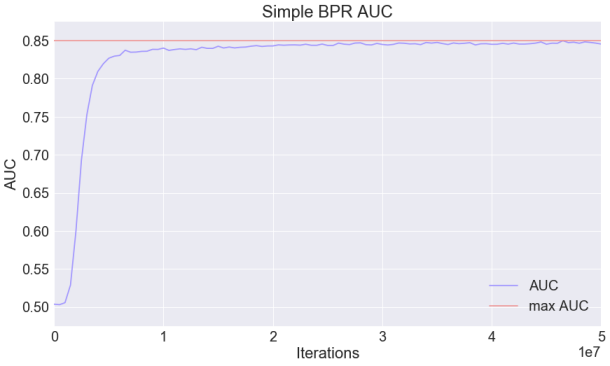
    
Figure 6: Simple BPR - convergence of AUC score

### BPR with Bias

It appears that the users interactions with recipes is highly biased by the recipes popularity. Biases are added to the BPR model in order to take this into account.

The model converges faster and we now obtain an AUC score of **84.22%**.

Figure 7 shows the BPR with bias AUC score convergence.

    
    
Figure 7: BPR with bias - convergence of AUC score

### BPR with oversampling

Given the facts that a few popular recipes represents the majority of the interactions, during the learning phase of BPR, those recipes are more likely to be selected as positive interactions.

This means that the model is trained a lot more on popular recipes than on unpopular ones. In order to reduces the impact of such biased data, an oversampling of the less popular recipes is performed in order to favorize the learning on less popular recipes.

The interactions are then duplicated according to the inverse popularity of their recipe with a specified power. Interactions with the most popular recipes will remains present only once in the set, while others will be duplicated. 

Two models are built, one with power 7/8 and one with factor 3/4 (power 1 means no oversampling, power 0 means oversampling until all recipes have same number of interactions). Figure 8 shows the effect of oversampling on the dataset with power 1 (no oversampling), power 7/8 and 3/4.

    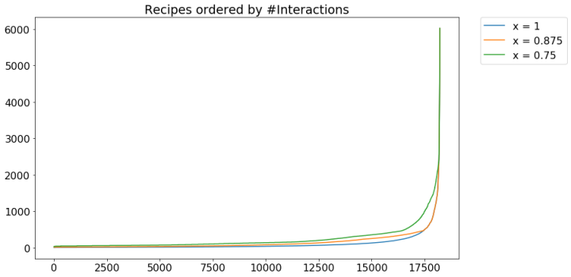
    
Figure 8: Number of interactions by recipes in dataset after oversampling

The two models, 7/8 and 3/4, achieved an AUC score of 83.89% and 83.33% respectively.

These models are less performant than the previous models but if we analyze the recipes they fail to rank properly we note that they offer some advantages compared to previous models. Figure 9 compares the failure rates of all models according to the popularity of the positive interaction's recipe .

    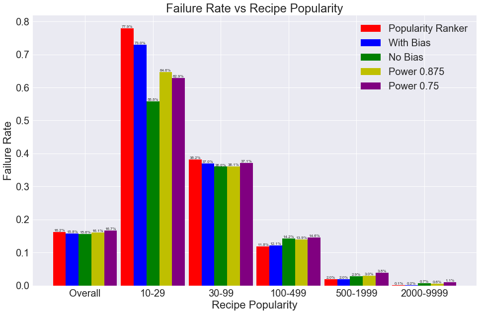
    
Figure 9: Failure rate comparison of models for different categories of popularity

We observe that even though oversampled models peforms bad overall, they tends to rank unpopular recipes better than simple popularity ranker models.

This graph highlights the bad performance of all BPR models in ranking recipe with low popularity, an shows users interaction is highly biased by the popularity of the recipes.

### Conclusion on Recommender Systems

The table 1 summarize the performance of the various recommender systems models developed:

| Model             | AUC scores    | Note    										 |
| ------------------|:-------------:|:----------------------------------------------:|
| Popularity Ranker | 83.89% 	   |	 										     |
| Simple BPR        | 84.55%        |	  							    			 |
| BPR with bias     | 84.22%        |										         |
| oversampled BPR (0.75)| 83.33%    |	Performs better on less popularity recipes   |
| oversampled BPR (0.875)| 83.89%   |	Performs better on less popularity recipes   |

None of the developed model outperforms significantly the basic popularity-based ranker. **This indicates that the users interactions are highly biased by the popularity of the recipes**. 

This is a potential problem since popular recipes tends to be less healthier than others. 

## Ingredient-based Users Clustering

Since no significant information can be obtain only from the interactions of users with recipes, we now try to clusterize the users according to other features of the recipes. The features we use are the ingredients of the recipes.

*The ingredient-base users clustering process can be found in this [Ingredients Model Notebook](python/IngredientsModel.ipynb)*

### TF-IDF approach

Users are linked to the recipes they made, then with all ingredients found in those recipes. A TF-IDF approach is used to create a User/Ingredients matrix representing how relevant an ingredient is for a user.

### User projection and Clustering

Users are projected in a 2D space using a Non-Negative Matrix Factorization followed by a t-SNE. 

They are then clusterized using a DBSCAN. The figure 10 shows the users 2D projection and clustering.

    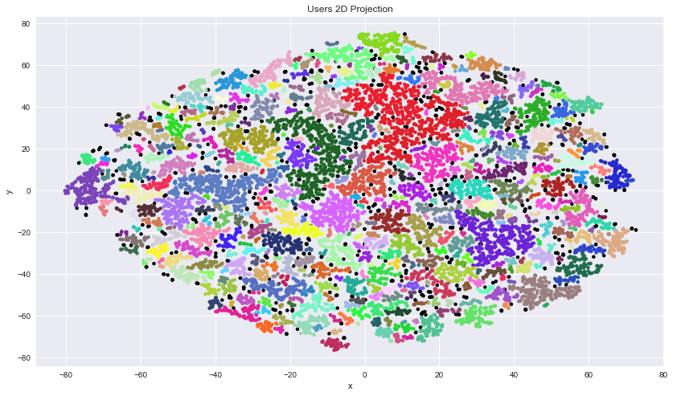
    
Figure 10: User projection and clustering

### Computing Clusters Ingredients Specificity

the specificity score of the ingredient for cluster are computed by comparing the average User/Ingredient relevance of the ingredients in a cluster compared as in the other clusters.

    

This gives a matrix representing how relevant/specific ingredients are for each cluster.

### Computing Recipes Similarity with Clusters

Using the ingredients/clusters specificity matrix, clusters and recipes similarity is computed by computing the average specificity of the ingredients in a recipe for a given cluster.

    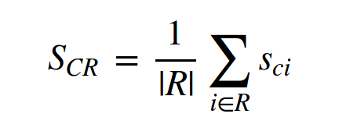

This gives a matrix representing how relevant/similar recipes are for each cluster, and allow to rank the recipes by relevance/similarity in each clusters.

### Associating Recipes to Clusters

The table 2 shows the list of 10 most similar recipes for the 10 main clusters of users. 

    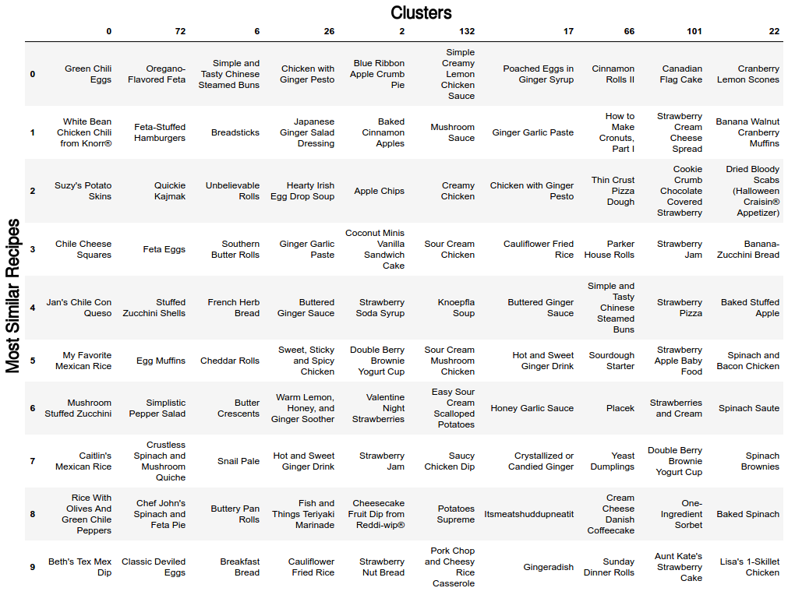
    
Table 2: Most similar recipes for clusters

For most clusters it is possible to intuitively identify what it represents with the list of most similar recipes.

For example **cluster 0** is mainly associated to Mexican recipes. **cluster 6** corresponds to bread and salty pastries, **cluster 2** is associated with fruit related recipes, **cluster 132** contians mainly recipes with sauce and **cluster 26** has mostly recipes of asian inspiration.

### Clusters Recipes Healthiness

Clusters can now be evaluated in term of recipes healthiness using the health scores of the most similar recipes

    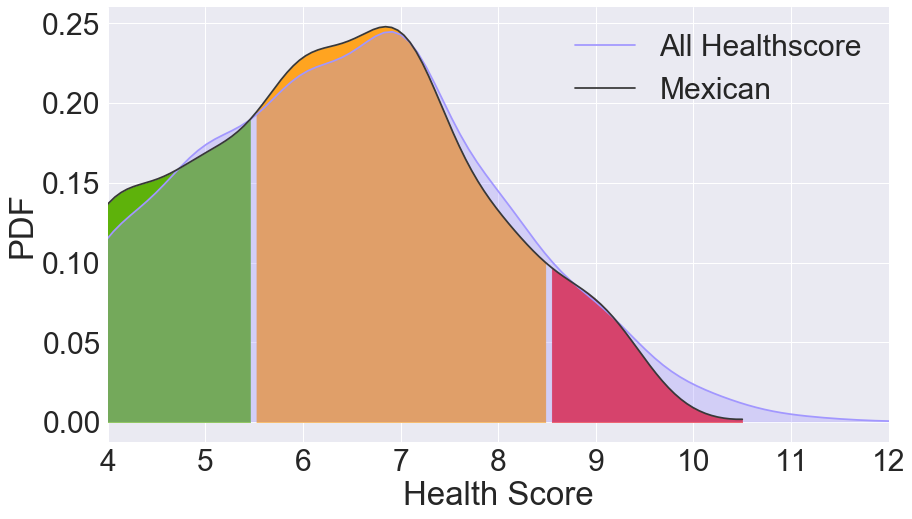
    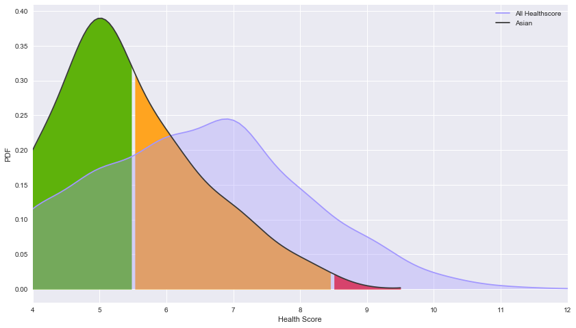
    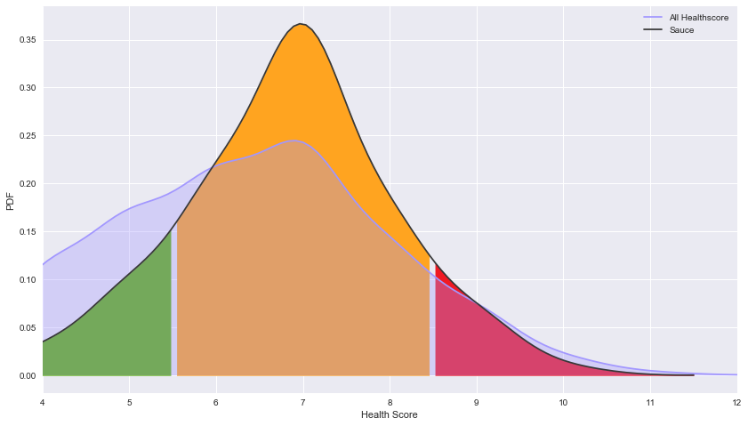
    
Figure 11: Recipes healthiness distribution in "Mexican Food", "Asian Food" and "Food with sauces" clusters

## Conclusion

The various models to recommend recipes to user demonstrate that the users interaction on allrecipes is highly biased by the recipes popularity. 

Considering that on average popular recipes are less healthy, this means that a recommender system model based only on user interactions would tend to recommend unhealthy recipes, which is a problem.

Using the ingredients of the recipes as features, intuitively relevant cluster of users have been created, showing preferences for different kinds of ingredients/recipes.

Using this preferences, we have been abled to rank the recipes relevance for every clusters. It therefore offers the possibility of recommending recipes that are relevant for users and constrain the recommender to propose heathier recipes.